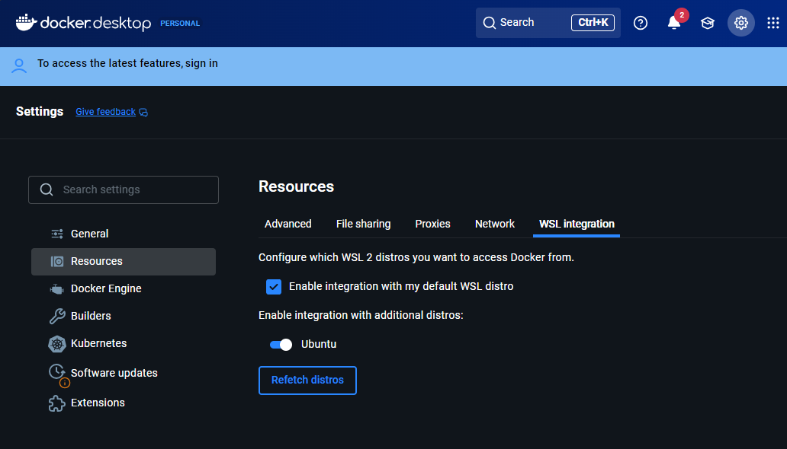
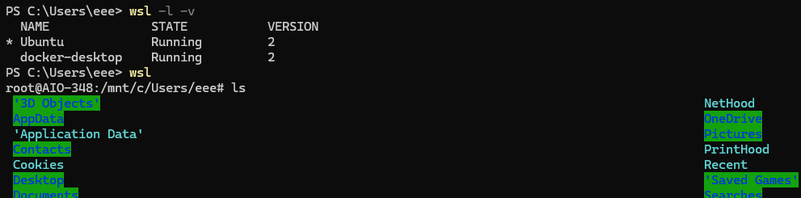
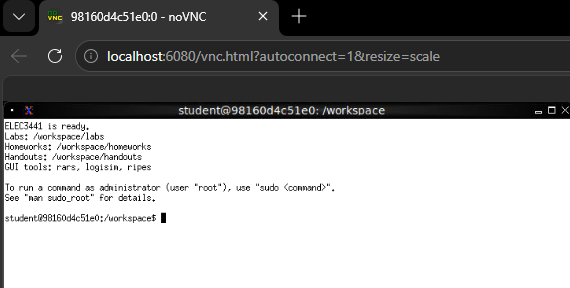

# ELEC3441 Docker Quick Start

Set up the course environment and finish the [Ready check](#ready-check) before Lab 1. The course tools run inside one Linux container. RARS, Logisim-Evolution, and Ripes open on a desktop in your web browser.

**Start here:** [Windows](#windows) · [macOS](#macos) · [Linux](#linux)

**After installation:** [Download and start](#4-download-and-start-the-course-environment) · [Use VS Code](#5-use-vs-code) · [Everyday commands](#6-everyday-commands) · [Course updates](#7-receive-course-updates) · [Troubleshooting](#8-troubleshooting)

## 1. Before you start

- Use a Windows, macOS, or Linux computer with a 64-bit processor. Check the Docker installation page for your platform's current system requirements.
- Recommended: a computer with at least 8 GB RAM and 20 GB free disk space, plus a stable internet connection for the first download.
- Enable hardware virtualization where required. On managed university computers, ask IT if Docker installation or virtualization is blocked.
- Install [Git](https://git-scm.com/install/). On Windows, install Git inside Ubuntu/WSL as described below.
- Keep the cloned repository folder until the course is complete. Your lab files will live there.

## 2. Install Docker for your platform

Follow the instructions for your operating system, then continue to [Install VS Code](#3-install-vs-code).

### Windows

Use [Docker Desktop for Windows](https://docs.docker.com/desktop/setup/install/windows-install/) with the WSL 2 backend. Check that your Windows version meets its requirements.

1. Open **PowerShell as Administrator** and install Ubuntu with WSL:

   ```powershell
   wsl --install -d Ubuntu
   ```

   Restart Windows if requested. Open **Ubuntu** from the Start menu and complete its first-run username and password setup. If you already have Ubuntu installed, use that installation.

2. In **PowerShell**, update WSL, set Ubuntu as the default distribution, and check its version:

   ```powershell
   wsl --update
   wsl --set-default Ubuntu
   wsl -l -v
   ```

   Ubuntu should show `2` in the `VERSION` column. If it shows `1`, run:

   ```powershell
   wsl --set-version Ubuntu 2
   ```

   If your distribution has a different name, use the exact name shown by `wsl -l -v` in place of `Ubuntu`. See [Microsoft's WSL installation guide](https://learn.microsoft.com/en-us/windows/wsl/install) for help.

3. Install and start Docker Desktop. Use the **WSL 2 based engine** setting if it is shown, and wait until the engine is running.

4. Open **Settings > Resources > WSL integration**, enable integration for **Ubuntu**, and select **Apply** or **Apply and Restart**, depending on your Docker Desktop version. See [Docker's WSL integration instructions](https://docs.docker.com/desktop/features/wsl/).

   

5. Open an **Ubuntu/WSL terminal** from the Start menu, or enter `wsl` in PowerShell. The example below shows Ubuntu running with WSL 2, followed by a Linux file listing:

   

   In WSL, `/mnt/c` corresponds to the Windows `C:\` drive. Your username and terminal prompt will differ from the screenshot.

6. In the **Ubuntu/WSL terminal**, install Git and check that Docker is accessible:

   ```sh
   sudo apt-get update
   sudo apt-get install git
   git --version
   docker version
   ```

   `docker version` should show both Client and Server information without a connection error.

**Run all remaining course commands in Ubuntu/WSL.** Keep Docker Desktop running.

### macOS

1. Install [Docker Desktop for Mac](https://docs.docker.com/desktop/setup/install/mac-install/), choosing the version for **Apple Silicon** or **Intel** to match your Mac.
2. Start Docker Desktop and wait until the engine is running.
3. Open **Terminal** and check Git and Docker:

   ```sh
   git --version
   docker version
   ```

   `docker version` should show both Client and Server information without a connection error.

Use the macOS Terminal for the course setup commands. Keep Docker Desktop running.

### Linux

1. Install [Docker Engine for your distribution](https://docs.docker.com/engine/install/) and Git. Ubuntu or Debian is recommended for this course.
2. Open a terminal and check:

   ```sh
   git --version
   docker version
   ```

   Confirm that your user can access Docker and that `docker version` shows both Client and Server information without an error. Follow the installation guide for your distribution if Docker reports a permissions problem.

## 3. Install VS Code

Install [Visual Studio Code](https://code.visualstudio.com/) for editing C, C++, and assembly files.

You can edit the cloned repository directly. Microsoft's **Dev Containers** extension is optional; install it from the VS Code Extensions view if you want to [attach VS Code to the course container](#5-use-vs-code).

## 4. Download and start the course environment

Use your computer's terminal, with **Ubuntu/WSL on Windows**. Clone the course repository once:

```sh
git clone https://github.com/dhuang-esl/elec3441-lab.git
cd elec3441-lab
```

Run the following commands from this `elec3441-lab` folder.

### Download the image

```sh
./manage pull
```

The repository's [`image.ref`](image.ref) selects the verified course image automatically. The first download can take several minutes, depending on your connection. Keep the terminal open until it finishes.

### Verify the initial setup

Before editing the lab files, run:

```sh
./manage verify
```

The final line should be:

```text
ELEC3441 student image verification passed
```

If it is not, see [Troubleshooting](#8-troubleshooting).

### Start the browser desktop

```sh
./manage up
```

Open the [course desktop in your browser](http://localhost:6080/vnc.html?autoconnect=1&resize=scale):

```text
http://localhost:6080/vnc.html?autoconnect=1&resize=scale
```



From the terminal on that desktop, launch a graphical tool by typing `rars`, `logisim`, or `ripes`.

### Where your files live

The host is your computer's environment, including Ubuntu/WSL on Windows. The container is the course Linux environment.

| In your cloned repository on the host | Inside the course container |
| --- | --- |
| `student-materials/` | `/workspace/` |
| `student-materials/labs/lab1/` | `/workspace/labs/lab1/` |
| `student-materials/handouts/lab1.pdf` | `/workspace/handouts/lab1.pdf` |

These are the **same files**. Editing a file under `/workspace` immediately updates `student-materials` in your clone. Course files come from Git; the Docker image provides the software.

> **Save your work under `/workspace`.** Each `./manage up` recreates the container. Files saved under `/workspace` remain in your clone; files elsewhere in the container, such as `/home/student`, and extra system packages do not survive recreation. Save open editor files before running it.

## 5. Use VS Code

For direct editing, open the cloned repository and edit files under `student-materials/labs/lab1`. Run `./manage shell` in your host terminal, or use the terminal on the browser desktop, to run compiler and simulator commands inside the course container.

To edit and use a container terminal within VS Code:

1. Install Microsoft's **Dev Containers** extension and start the environment with `./manage up`.
2. Open the **Command Palette** from the **View** menu.
3. Choose **Dev Containers: Attach to Running Container...**.
4. Select **elec3441-lab**.
5. Open `/workspace/labs/lab1` inside the container.
6. Use **Terminal > New Terminal** for compiler and simulator commands.

The browser desktop remains available for the graphical tools. See the [VS Code container attachment guide](https://code.visualstudio.com/docs/devcontainers/attach-container) for details.

## Ready check

Finish these checks before your first lab:

- [ ] `./manage pull` and the initial `./manage verify` complete successfully.
- [ ] The browser desktop opens at `localhost:6080`.
- [ ] `rars`, `logisim`, and `ripes` launch from the browser desktop terminal.
- [ ] VS Code can edit `student-materials` directly, or attach to `elec3441-lab` and open `/workspace`.
- [ ] You understand that host `student-materials` and container `/workspace` are the same files, and save your work there.

## 6. Everyday commands

Run these in your **host terminal**, from the cloned `elec3441-lab` folder:

| Task | Command |
| --- | --- |
| Start or recreate the environment | `./manage up` |
| Stop the environment | `./manage stop` |
| Open a terminal inside the running container | `./manage shell` |
| Check whether the container is running | `./manage status` |

After starting the environment, open the [browser desktop](http://localhost:6080/vnc.html?autoconnect=1&resize=scale). If it is already running, you can reopen the browser or use `./manage shell` without recreating it.

## 7. Receive course updates

When the teaching team announces new material, save your files and check your working copy:

```sh
git status
```

Commit or stash unfinished changes before continuing. Then update the cloned repository:

```sh
git pull
```

Resolve any Git conflicts before proceeding. If the teaching team also announces a **software environment update**, download the new image:

```sh
./manage pull
```

Then start the environment:

```sh
./manage up
```

The new course files appear under `/workspace`. If an instructor update changes a file you edited, Git may ask you to merge the changes. Keep your own work in local commits or a private fork; do not push it to the official course repository.

## 8. Troubleshooting

### Docker command not found or cannot connect

Start Docker Desktop on Windows or macOS and wait for its engine to be ready. On Windows, use Ubuntu/WSL and check that Docker Desktop's Ubuntu integration is enabled. If **WSL integration** is missing from Settings, check that Docker Desktop is using Linux containers.

On Linux, confirm that Docker Engine is installed, running, and accessible to your account. Run `docker version` again to check.

### Permission denied when running manage

From the cloned repository, run:

```sh
chmod +x manage
```

Then repeat the original `./manage` command.

### The browser desktop does not open

Check the container:

```sh
./manage status
```

Save any open work, then run `./manage up`. Wait a few seconds and reload the [browser desktop](http://localhost:6080/vnc.html?autoconnect=1&resize=scale). If startup reports that port `6080` is already in use, check which application is using it.

### The pull or verification fails

Check Docker, internet access, free disk space, and `git status`. Then retry:

```sh
./manage pull
./manage verify
```

Verification also checks the lab files in your working copy. If you have already edited them, a failure may come from those changes even when Docker is working. Keep your work and inspect the reported error before changing any files.

If the failure continues, send the teaching team:

- Your operating system and CPU type, such as Intel/AMD or Apple Silicon.
- The failed command and its full error output.
- The outputs of `docker version`, `git status`, and `./manage status`.
- A screenshot of the problem.
